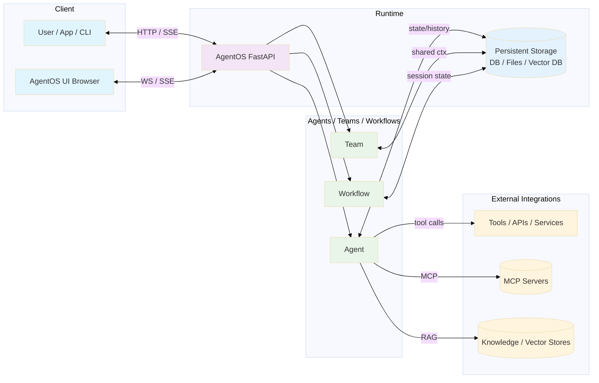

### Architecture

```mermaid
---
config:
  layout: dagre
  theme: base
---
flowchart LR
 subgraph Client["Client"]
        U["User / App / CLI"]
        UI["AgentOS UI Browser"]
  end
 subgraph Runtime["Runtime"]
        OS["AgentOS FastAPI"]
        ST[("Persistent Storage<br>DB / Files / Vector DB")]
  end
 subgraph AgentsLayer["Agents / Teams / Workflows"]
        A1["Agent"]
        T1["Team"]
        W1["Workflow"]
  end
 subgraph Ext["External Integrations"]
        TOOLS["Tools / APIs / Services"]
        MCP[("MCP Servers")]
        KNOW[("Knowledge / Vector Stores")]
  end
    U <-- HTTP / SSE --> OS
    UI <-- WS / SSE --> OS
    OS --> A1 & T1 & W1
    A1 <-- state/history --> ST
    T1 <-- shared ctx --> ST
    W1 <-- session state --> ST
    A1 -- tool calls --> TOOLS
    A1 -- MCP --> MCP
    A1 -- RAG --> KNOW
    style U fill:#e1f5fe
    style UI fill:#e1f5fe
    style OS fill:#f3e5f5
    style ST fill:#e3f2fd
    style A1 fill:#e8f5e8
    style T1 fill:#e8f5e8
    style W1 fill:#e8f5e8


```
